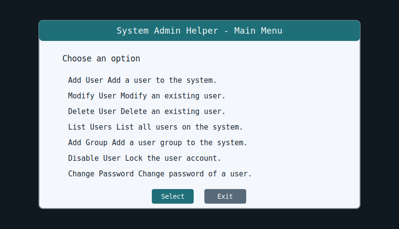
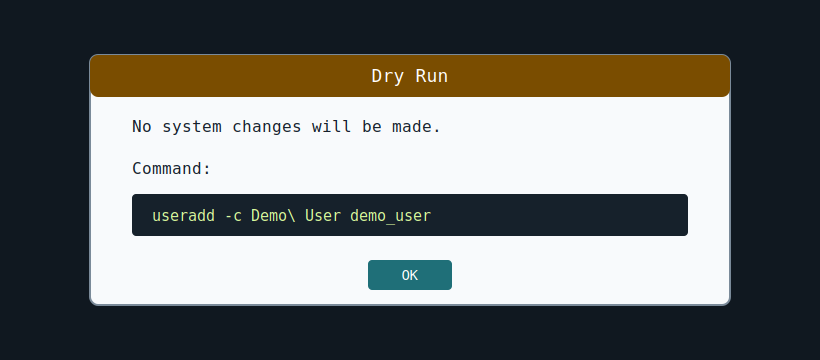

# System Admin Helper

System Admin Helper is a Bash/whiptail menu application for common Linux user and group administration tasks.



## Features

- Add, modify, delete, list, enable, and disable users.
- Add, modify, delete, and list groups.
- Change user passwords with `passwd --stdin` or `chpasswd`, depending on distro support.
- Dry-run mode for previewing privileged commands without changing the system.
- Command preview and confirmation before privileged actions run.
- JSON-lines audit log for admin, target, action, status, dry-run state, and command.
- Backup prompts before destructive user/group delete actions.
- Restore utility for account database backups.
- Runtime compatibility checks for optional flags such as `userdel -Z`, `groupadd -U`, and `groupmod -U`.
- Install/uninstall scripts and Makefile targets for release packaging.

## Screenshots



## Requirements

Run on a Linux system with root privileges and standard shadow user-management tools.

Fedora/RHEL:

```bash
sudo dnf install newt xterm-resize shadow-utils
```

Debian/Ubuntu:

```bash
sudo apt-get install whiptail xterm passwd login
```

openSUSE:

```bash
sudo zypper install newt xterm shadow
```

`resize` is optional. If it is unavailable, the app falls back to terminal dimensions reported by `tput`.

## Usage

Update an existing clone before running:

```bash
git pull
sudo make install
```

From the repository root:

```bash
sudo ./scripts/main.sh
```

Or from the scripts directory:

```bash
cd scripts
sudo ./main.sh
```

The launcher validates privileges and dependencies before opening the main menu. It does not install packages automatically.

## Dry-Run Mode

The launcher asks whether to enable dry-run mode for the current session. You can also force it from the shell:

```bash
sudo SAH_DRY_RUN=1 ./scripts/main.sh
```

Dry-run mode previews and audits commands without applying system changes.

## Audit And Logs

Runtime files are written under `scripts/logs/` by default:

- `commands.log`: command stdout/stderr.
- `audit.log`: JSON-lines audit records.
- `backups/`: account database backups.

Override locations if needed:

```bash
sudo SAH_LOG_DIR=/var/log/system-admin-helper ./scripts/main.sh
```

### Legacy Logs File Migration

Older versions wrote command output directly to a regular file named `scripts/logs`. Current versions use `scripts/logs/` as a directory.

If an old `scripts/logs` file exists, startup now migrates it automatically to:

```text
scripts/logs/legacy-commands.log
```

Then it creates:

```text
scripts/logs/commands.log
scripts/logs/audit.log
scripts/logs/backups/
```

This fixes the Linux Mint error:

```text
mkdir: cannot create directory '.../scripts/logs': File exists
mkdir: cannot create directory '.../scripts/logs': Not a directory
```

## Backups And Restore

Before destructive delete actions, the app prompts to back up:

- `/etc/passwd`
- `/etc/group`
- `/etc/shadow`
- `/etc/gshadow`

Restore a backup deliberately with:

```bash
sudo ./scripts/restore-backup.sh scripts/logs/backups/YYYYMMDD-HHMMSS-label
```

For non-interactive restore automation:

```bash
sudo SAH_ASSUME_YES=1 ./scripts/restore-backup.sh /path/to/backup
```

## Install

Install a system launcher:

```bash
sudo make install
```

Run the installed launcher:

```bash
sudo system-admin-helper
```

Default paths:

- Scripts: `/usr/local/lib/system-admin-helper`
- Launcher: `/usr/local/sbin/system-admin-helper`

Custom prefix:

```bash
sudo make install PREFIX=/opt/system-admin-helper
```

Uninstall:

```bash
sudo make uninstall
```

## Development Checks

Run syntax checks:

```bash
make syntax
```

Run the test runner:

```bash
make test
```

If Bats is installed, `make test` runs `test/*.bats`. If Bats is unavailable, the runner still performs Bash syntax checks and reports that Bats tests were skipped.

Install Bats on Fedora/RHEL:

```bash
sudo dnf install bats
```

Install Bats on Debian/Ubuntu:

```bash
sudo apt-get install bats
```

Run a non-root smoke test:

```bash
bash scripts/main.sh
```

Expected result:

```text
Privileges Error!: Error! Please run as root user.
```
